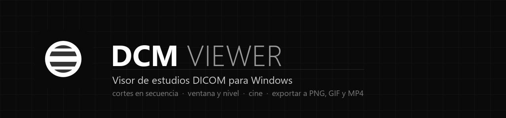
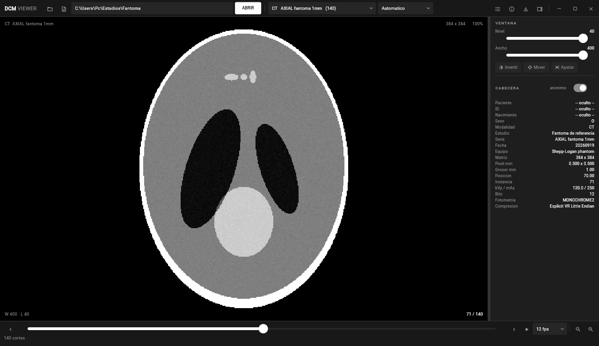
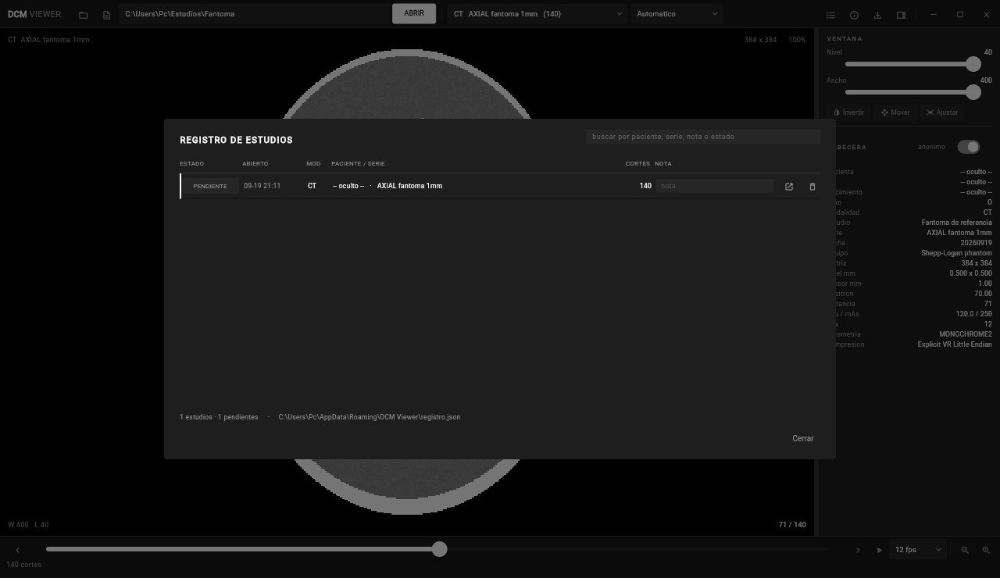
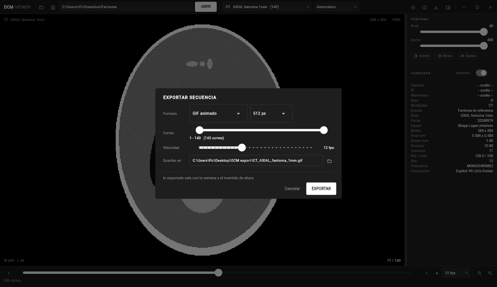
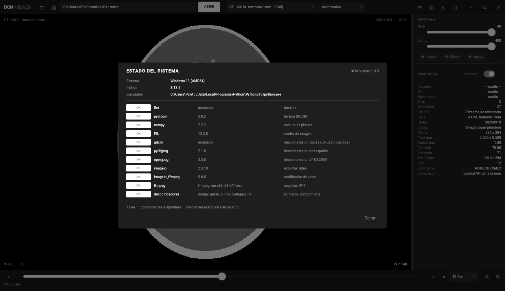

<p align="center"></p>

<p align="center">
  <a href="https://github.com/Losif24/dcm-viewer/releases/latest"></a>
  
  
  
</p>

<table>
  <tr>
    <td width="50%"><p align="center"><sub><b>Recorriendo un estudio de 140 cortes</b></sub></p></td>
    <td width="50%"><p align="center"><sub><b>Registro de estudios</b></sub></p></td>
  </tr>
  <tr>
    <td width="50%"><p align="center"><sub><b>Exportar a PNG, GIF o MP4</b></sub></p></td>
    <td width="50%"><p align="center"><sub><b>Estado del sistema</b></sub></p></td>
  </tr>
</table>

<p align="center"><sub>Hecho con</sub><br></p>

<details>
<summary><b>In English</b></summary>

**DCM Viewer** is a free, open source DICOM viewer for Windows. Point it at a
study folder: it groups the series, sorts the slices by their real anatomical
position, and lets you scroll, window/level by dragging, read Hounsfield values
under the cursor, play cine and export the sequence to PNG, GIF or MP4.

It ships as a self-contained installer — no Python, no dependencies, no
administrator rights — and makes no network connection except an optional,
opt-out-by-default update check. Not a certified medical device: not for
diagnosis.

</details>

# DCM Viewer

Los cortes de un estudio, en orden y sin ceremonia.

Le señalas la carpeta de un estudio DICOM y lo abre: agrupa las series, ordena
los cortes por su posición real —no por el nombre del archivo, que casi nunca
coincide— y te deja recorrerlos con la rueda. Ventana y nivel arrastrando,
como en cualquier estación. Hounsfield bajo el cursor. Cine. Y lo que estés
viendo sale a PNG, GIF o MP4 sin salir del programa.

**No necesita Python.** El instalador lleva todo dentro, se instala sin
permisos de administrador y no abre una sola conexión de red.

---

## Qué hace

| | |
|---|---|
| Abre una carpeta y encuentra las series | agrupa por `SeriesInstanceUID` y ordena proyectando `ImagePositionPatient` sobre la normal del plano |
| Recorre los cortes | rueda, flechas, barra, o cine con velocidad regulable |
| Ventana y nivel | arrastrando sobre la imagen, o con los preajustes de siempre: cerebro, hueso, pulmón, mediastino, abdomen, hígado, angio |
| Respeta lo que dejó el escáner | si el estudio trae un XML de análisis (CS 3D Imaging y compañía), usa **esa** ventana, no la del rango entero del equipo |
| Dice el valor real | Hounsfield bajo el cursor, con el `RescaleSlope`/`Intercept` aplicado |
| Exporta la secuencia | PNG numerados, GIF animado o MP4 (H.264), con rango de cortes, tamaño y velocidad |
| Lleva un registro | qué estudios has abierto, en qué estado están y con qué nota |
| Enseña las tripas | qué componentes hay en la máquina y cuáles faltan, antes de que algo falle a medias |
| Se mantiene al día | avisa cuando hay versión nueva y se actualiza solo, si tú lo enciendes |

Los datos del paciente vienen **ocultos por defecto**. El interruptor del panel
los muestra cuando hace falta.

---

## Instalar

Descarga el instalador de [releases](https://github.com/Losif24/dcm-viewer/releases/latest)
y ábrelo. No pide administrador y no hace falta tener Python.

O desde el código:

```bash
pip install -r requirements.txt
python main.py                       # o: python main.py C:\ruta\al\estudio
```

También puedes arrastrar la carpeta del estudio sobre `DCM Viewer.bat`.

---

## Atajos

| | |
|---|---|
| rueda, `←` `→`, `Inicio` `Fin` | moverse por los cortes |
| arrastrar sobre la imagen | ventana y nivel |
| `espacio` | cine |
| `i` · `m` · `r` | invertir · mover · ajustar |
| `+` `-` | zoom |
| `p` | panel lateral |
| `Ctrl+E` · `Ctrl+L` · `Ctrl+D` | exportar · registro · estado del sistema |

---

## Formatos

Cualquier DICOM con imagen que `pydicom` sepa leer: sin comprimir, RLE, JPEG
sin pérdida, JPEG 2000. Series de un archivo por corte y multiframe. Probado
con TAC, CBCT dental y ecografía en color.

La descompresión va por **GDCM**, que en un JPEG sin pérdida es unas cuatro
veces más rápido que la alternativa; si no está, cae a `pylibjpeg` sin
enterarse nadie. En un CBCT de 356 cortes a 545×545 eso son 23 ms por corte en
vez de 90, y con la precarga por delante el cine se sostiene por encima de los
30 fps.

---

## Privacidad

- No hay red, con **una sola excepción**: buscar actualizaciones. Viene
  apagado; se enciende en *Estado del sistema* (`Ctrl+D`) y lo único que hace
  es preguntar a GitHub cuál es la última versión publicada. Nunca manda datos.
- Ni telemetría, ni informes de error, ni analítica.
- Las imágenes se leen donde están; no se copian a ningún sitio.
- El registro (carpetas abiertas, fechas, notas) se queda en
  `%APPDATA%\DCM Viewer\registro.json`, y al desinstalar se pregunta si se borra.
- Lo exportado lleva la imagen y nada más: ninguna etiqueta DICOM viaja dentro.

Detalle completo en [PRIVACIDAD.md](PRIVACIDAD.md) y [SECURITY.md](SECURITY.md).

> **Esto no es un producto sanitario certificado.** No está aprobado por
> ninguna agencia y no debe ser la única base de un diagnóstico. Sirve para
> ver, revisar y documentar; el diagnóstico se hace en una estación homologada.

---

## Preguntas frecuentes

**¿Cómo abro un archivo .dcm?** Abre la carpeta entera del estudio, no un
archivo suelto: un estudio son cientos de archivos y el visor necesita verlos
todos para ordenarlos. Arrastra la carpeta sobre el icono, o pega su ruta.

**¿Sirve para un CBCT dental?** Sí. Está probado con estudios de Carestream
CS 3D Imaging, incluidos los comprimidos en JPEG sin pérdida, y usa la ventana
que el propio programa del escáner dejó guardada.

**¿Necesito Python?** No, si usas el instalador. Va todo dentro.

**¿Funciona sin internet?** Sí, siempre. La única función que usa la red es
buscar actualizaciones, y viene apagada.

**¿Puedo convertir un estudio en un vídeo?** Sí: `Ctrl+E`, eliges MP4, el rango
de cortes y la velocidad.

**¿Sirve para diagnosticar?** No. No es un producto sanitario certificado.

---

## Apoyar el proyecto

El visor es gratis y de código abierto, y va a seguir siéndolo. Si te ahorra
trabajo y quieres echar una mano:

| | |
|---|---|
| **Bre-B** | `@NEQUIJOS24501` |

En la app de tu banco: enviar dinero → Bre-B → pegar la llave. Funciona desde
cualquier entidad del sistema. También ayuda una estrella en el repositorio o
un issue bien escrito.

---

## Por dentro

| Archivo | Qué es |
|---|---|
| `main.py` | la interfaz entera: barra, lienzo, panel, diálogos |
| `dicomio.py` | indexado, orden, caché de cortes y render a PNG |
| `exportar.py` | PNG, GIF y MP4 |
| `registro.py` | el registro de estudios en disco |
| `entorno.py` | qué hay instalado y qué falta |
| `actualizacion.py` | buscar y aplicar versiones nuevas |
| `packaging/` | el empaquetado y el instalador |

Para compilar el instalador hacen falta [Inno Setup 6](https://jrsoftware.org/isdl.php)
y PyInstaller; después, `packaging\construir.bat` deja el `.exe` en
`packaging\salida`.

---

## Licencia

MIT. Haz lo que quieras con él.
